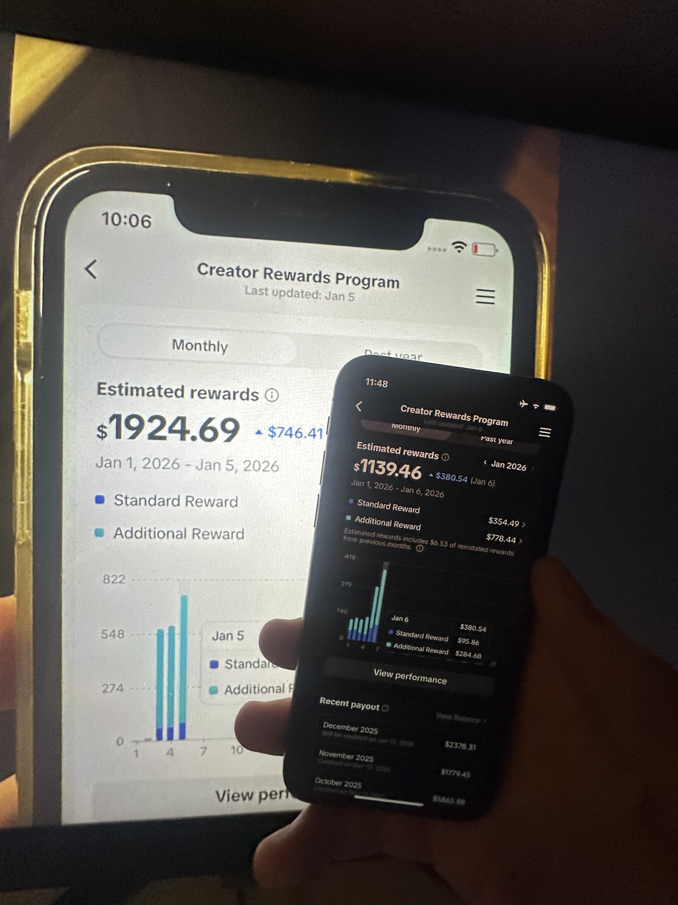
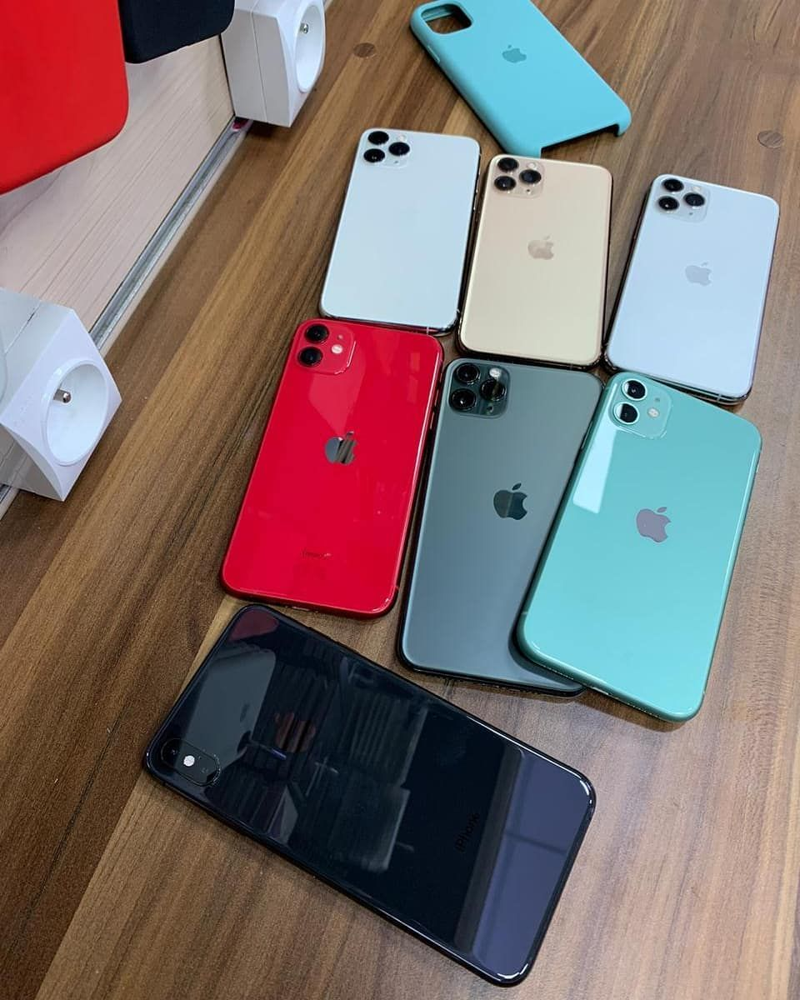
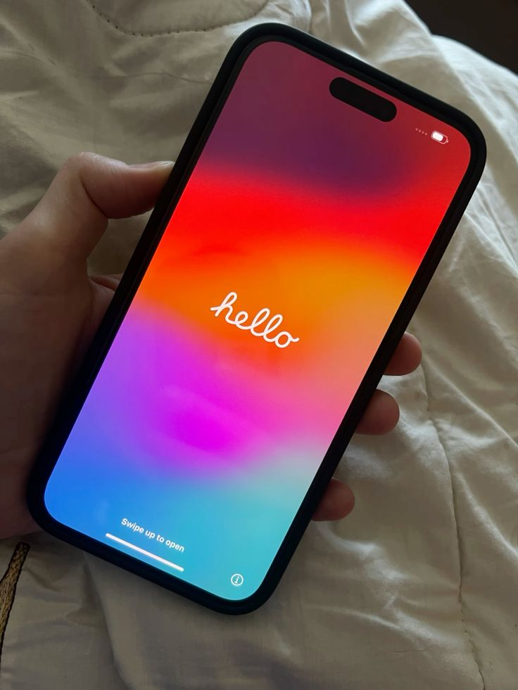
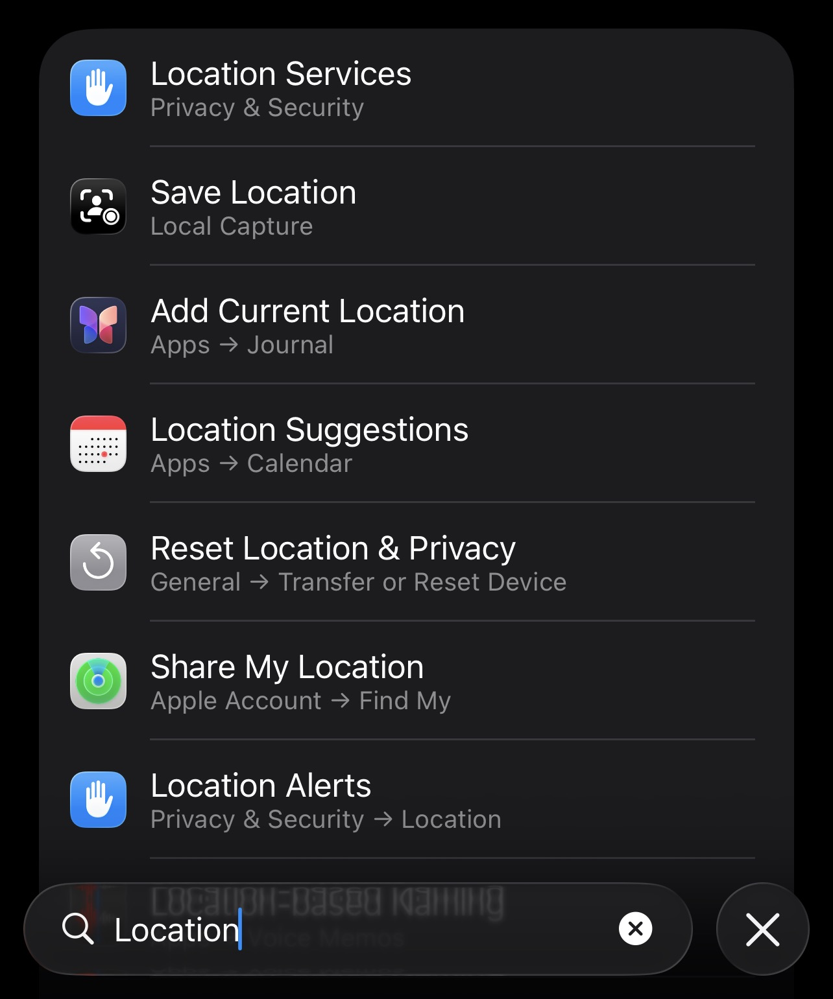
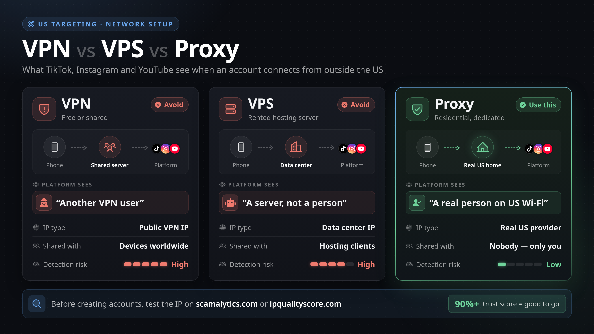
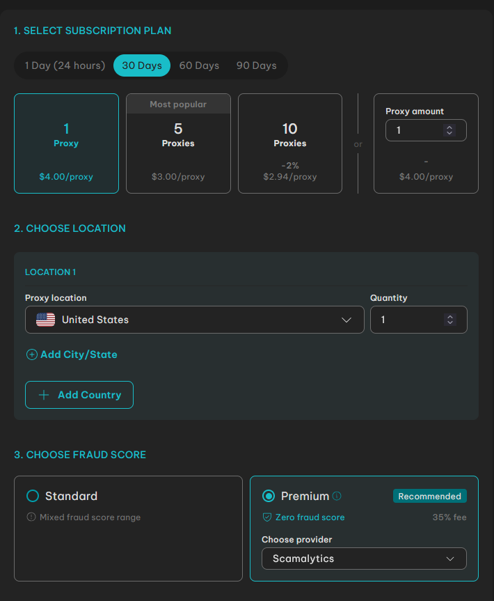
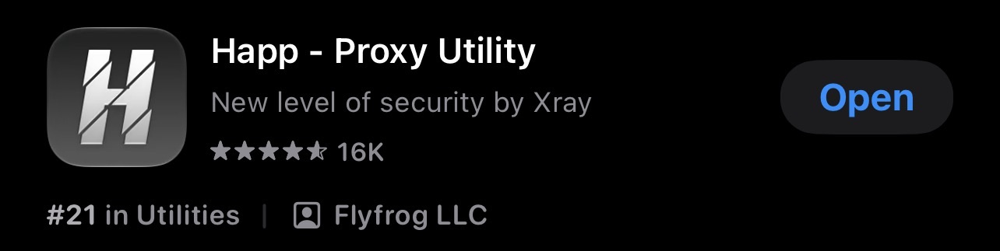
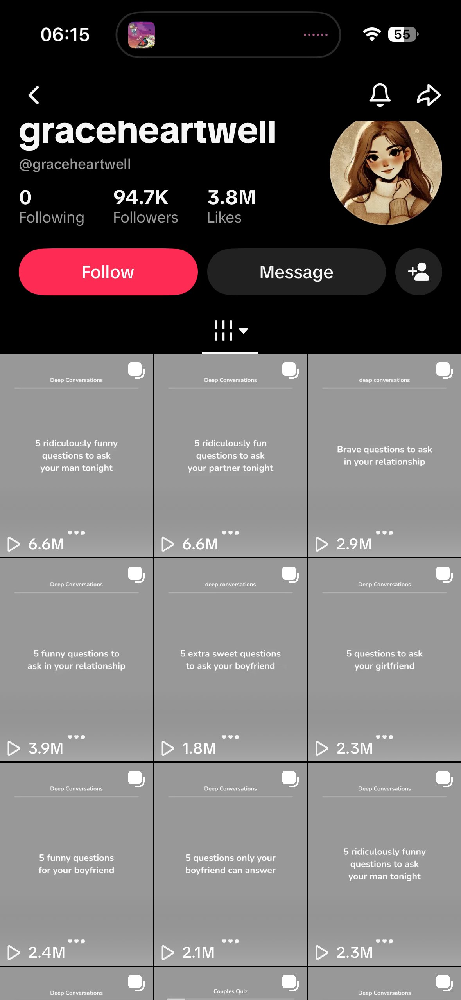
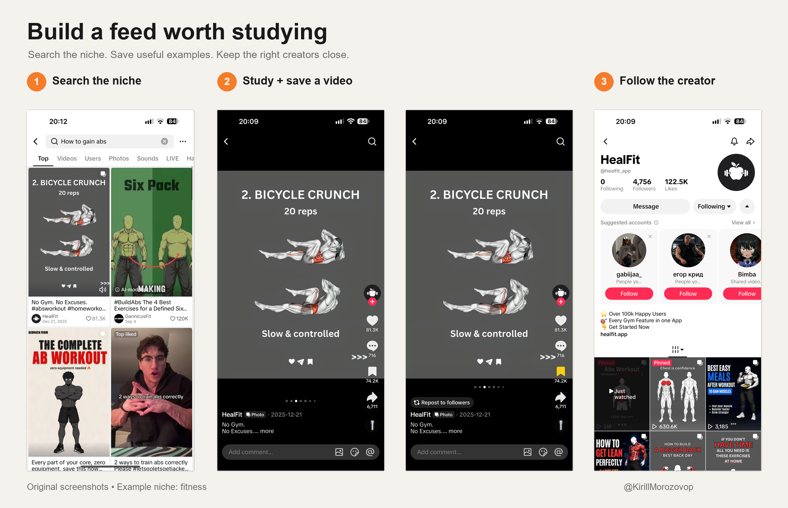
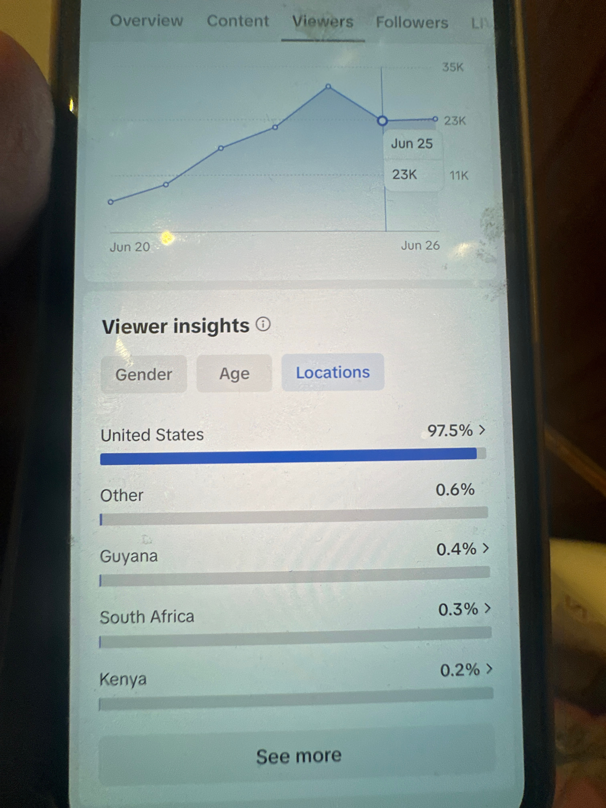

# The US Audience Playbook for Creators Abroad

If you're trying to reach US viewers from abroad, it's easy to spend more time comparing SIM cards, VPNs, and phone settings than making your first video. The guides don't even agree on what you need.

I've grown medical content to roughly **1.7 million followers** and earned from TikTok while living outside the US.

This is the process I follow before the first upload, from setting up the phone to getting the account ready. I'll explain the choices as we go, including how I do it without a US SIM card.



We'll start with TikTok, then cover what changes for Instagram and YouTube.

Use this setup at your own risk.

*make sure you save this article so you can read it later or prompt it with your agent*

## 1. A separate iPhone makes the setup easier to control

I start with a separate iPhone. My personal accounts, contacts, and everyday browsing stay on my main phone.

You don't need an expensive new phone. Buy a used model that can run a currently supported iOS version and the apps you need. Check compatibility before paying; the old “iPhone 8 or newer” advice is aging badly.



Prepare the dedicated phone before installing the social apps:

1. **Remove the physical SIM** and disable any active eSIM.
2. **Back up what you need**, then factory-reset the phone.
3. **Set it up as a new device.** Restoring your personal backup brings the old setup right back.

I use Wi-Fi with Airplane Mode on. Turn Wi-Fi back on after enabling it, and check Bluetooth separately if you want it off.

A reset clears the local setup; existing account history stays with the platform.

## 2. Set the phone up for the market you work in

During onboarding, choose English and the United States as the device region. Use a dedicated Apple Account with an email you control, then update iOS before installing the social apps.



In **Settings → General → Language & Region**, check the language and region again. Set the clock to the US time zone you plan to work in; “US time” can mean several different things.

In **Settings → Privacy & Security → Location Services**, review location access. I keep location access off on this work device and skip contact syncing inside the social apps.



The phone region and the App Store country are separate settings. A US device region doesn't switch the store automatically. If you need a different storefront to download an app, change it through Apple's account settings and use billing information that is valid for that account.

Skip optional analytics and ad-personalization prompts during onboarding if you don't need them.

[TikTok uses information](https://support.tiktok.com/en/account-and-privacy/account-privacy-settings/location-services-on-tiktok) including SIM region, IP address, and system settings to estimate location. Location and language are also among its recommendation signals. Turning off GPS access doesn't remove the other signals.

## 3. Choose the connection by its IP, stability, and cost

VPN, VPS, and proxy get thrown around as if they were three quality levels. They're different things.

A **VPN** routes traffic through a tunnel. The exit IP can be shared or dedicated; the word VPN alone doesn't tell you its reputation.

A **VPS** is a rented virtual server. You can run a VPN or proxy on it, but its IP will usually belong to a hosting network.

A **proxy** forwards traffic through another endpoint. It can use a datacenter, ISP, residential, or mobile IP. Buying something called a proxy doesn't automatically mean you're browsing through someone's home Wi-Fi.



*Read this as a simplified buying guide. IP type and actual routing matter; a proxy label alone doesn't prove a home connection or low risk. The 90%+ target applies only to a positive anonymity rating, not a fraud score.*

For this setup, my pick is a **dedicated US ISP proxy with a stable IP** from [IPRoyal](https://iproyal.com/?r=863249). I want the same connection each time and a bill that doesn't climb while I'm watching videos.



ISP proxies use IPs registered with internet service providers, but they can still be hosted on servers. Residential proxies route through residential connections; plans billed by traffic can get expensive when you're watching and uploading video. Mobile proxies use cellular networks.

A dedicated VPN can also fit. I skip free shared VPNs for this workflow because I have less control over the exit IP and who else uses it. Paying for a product, by itself, doesn't prove the IP is good.

Before buying, check:

- **US location** for the exit IP.
- **Dedicated and static:** whether the IP is yours and stays the same.
- **Traffic allowance:** how much watching and uploading the plan covers.
- **SOCKS5 support** for the Happ setup below.

Those details matter more than a “premium” badge.

### Happ connects the proxy to the phone

Install **[Happ – Proxy Utility](https://apps.apple.com/us/app/happ-proxy-utility/id6504287215)** from the App Store. This app is the client; your proxy provider supplies the connection.



In Happ:

1. Open **+ → Manual Input → SOCKS**.
2. Enter the **server address** and **SOCKS5 port** from your provider's dashboard.
3. Add the **username and password** from that same connection.
4. **Save and connect.**

Use the port shown for SOCKS5. HTTP and SOCKS5 credentials can look almost identical while using different ports, so copying the wrong line can leave you debugging a perfectly good proxy.

Allow Happ to add its VPN configuration when iOS asks. Seeing “VPN” in iOS is normal: that's how the client routes traffic through the connection. Check that your routing profile sends the social apps through the proxy rather than a direct-connection exception.

Check the public IP from the phone with the connection active. Use **[IPLocation](https://www.iplocation.net/)** to check the country and network, and **[Scamalytics](https://scamalytics.com/ip)** or **[IPQualityScore](https://www.ipqualityscore.com/free-ip-lookup-proxy-vpn-test)** to inspect the IP's reputation. If the result still shows your normal connection, fix the routing before creating accounts.

If a checker gives a positive anonymity rating where higher is better, **90%+ is my working target**. Read the label first: on Scamalytics and IPQualityScore, a higher **fraud score** is worse. Use each site's good/low-risk verdict in its own context; these scores don't certify future reach on TikTok.

Once the connection works, keep it active while installing and using the social apps. Recheck after a restart or a connection change instead of assuming the profile is still routing traffic.

## 4. Use the first few days to learn the niche

Create the account with a Gmail or Outlook address you control. Verify the email, enable two-factor authentication, and skip importing your contacts.



My usual TikTok routine:

- **Day 1:** Leave the account for about a day.
- **Next 2–3 days:** Browse the niche and fill in the profile gradually.
- **Around day 4–5:** Start posting.

Those are my timings, so adjust them to your own routine.

Start with normal browsing, then search in your audience's language. For a fitness account, try “how to gain abs,” “high protein meals,” or “gym tips for beginners.” If the feed is in the wrong language, find English content first, then narrow down to the niche.

Watch relevant videos, save the ones worth studying, and follow creators you want to keep up with. Read the comments for questions and wording you can use in your own videos.



I can spend around an hour a day on this early research, then keep shorter sessions once I'm posting. Engage with what interests you; there's no quota of likes, follows, or DMs to hit.

Your feed becomes a library of references. **Check your upload analytics separately** to see whether the people watching you are in the US.

## Keep one setup record so you can find what changed

If you change the IP, niche, and posting routine at once, you won't know what helped. Write down the setup before you start changing it.

Keep one record for each account. You can copy this into a note or give it to your agent:

```text
US AUDIENCE SETUP

Platform + account:
Target viewer and niche:
Device + iOS version:
Device language / region / time zone:
SIM and location settings:
Connection type + provider:
Expected exit country / city:
IP check date + result:
Email verified + 2FA enabled:
First upload date:

AFTER PUBLISHING
Video topic + opening hook:
Top viewer countries:
US viewer share, if available:
Watch time / completion, if available:
Account or recommendation notices:
One change for the next upload:

Leave missing analytics blank.
Keep passwords and recovery codes in a password manager.
```

## Instagram and YouTube need their own decisions

For **Instagram**, I give myself roughly a week to research the niche and prepare the profile. Use a public account for reaching non-followers, and check Account Status for recommendation restrictions if distribution looks wrong.

Study the creators your target audience follows and the content they send to friends. Upload a clean original export instead of a copy carrying another app's watermark. Keep the subject, spoken language, on-screen text, and profile promise aimed at the same viewer.

For **YouTube**, don't spend a week treating the channel's country setting as a US targeting switch. [YouTube explicitly says](https://support.google.com/youtube/answer/141805?hl=en) that setting isn't used to decide how videos are recommended.

Write the title and captions for the viewer you want, then check viewer geography in YouTube Analytics. You can reuse an idea across TikTok, Reels, and Shorts; check the audience each platform actually sends you.

For all three, English is a starting point. An American viewer still needs a reason to watch. The examples, problem, product, and wording should fit the person you're trying to reach.

## The first uploads show what the setup is doing

Give the first video your best shot. Make the subject obvious early and deliver what the opening promises. Then check where the viewers came from and whether they stayed.

If the country is wrong, review the connection and the account's regional settings, then look at whether the content itself attracts that market. A working US IP alone doesn't promise an all-US audience.

If people arrive and leave immediately, work on the video. If there are no views, check visibility, processing, review status, and recommendation notices before wiping the phone again.

A failed follow action also isn't enough to diagnose a shadowban. Repeating it over and over won't tell you why it failed.

Treat the first uploads as a test of the whole workflow. Audience geography and monetization eligibility are separate; an IP change doesn't establish eligibility for a payout program.



Once you're managing a larger group of accounts, document ownership, access, exports, and uploads before adding automation. Fix the workflow while you can still see where it breaks.

And please, put some effort into what you post. A properly configured phone is still going to upload whatever AI slop you feed it.

Follow me for more practical breakdowns on building apps and distributing them.
